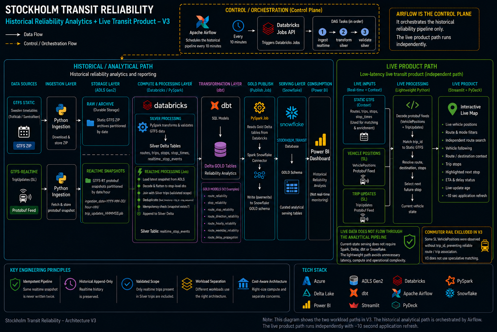
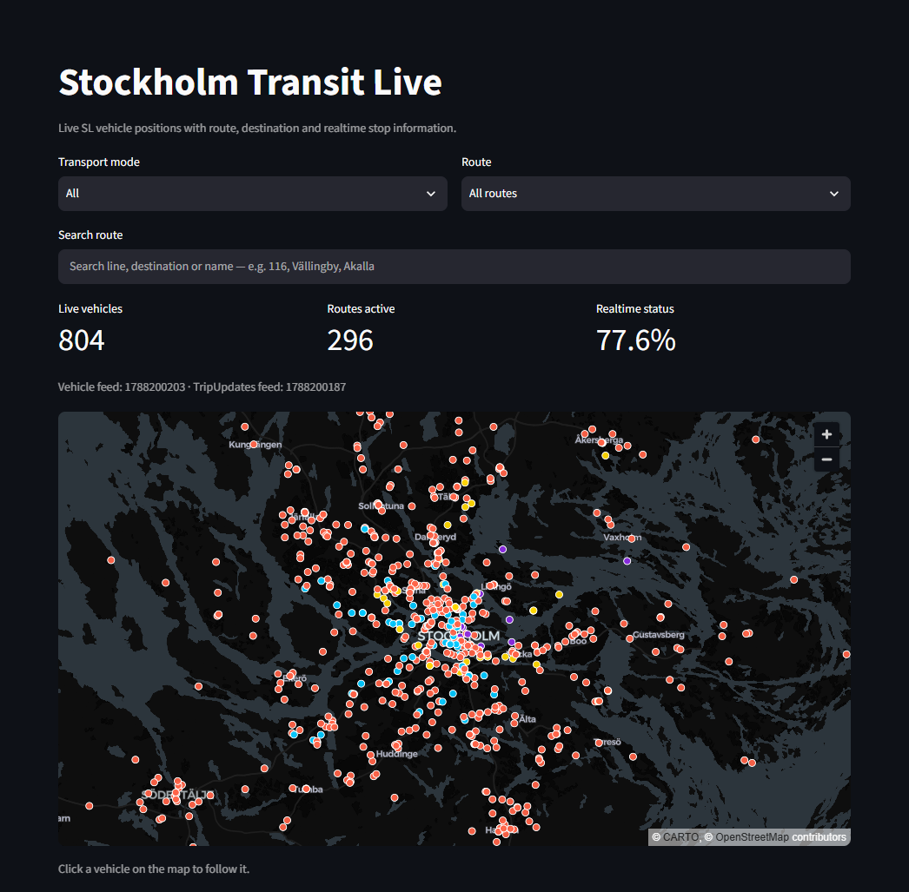
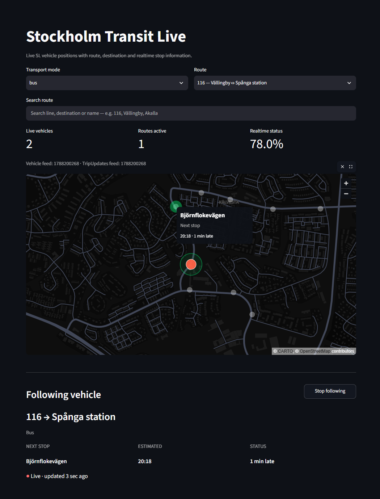
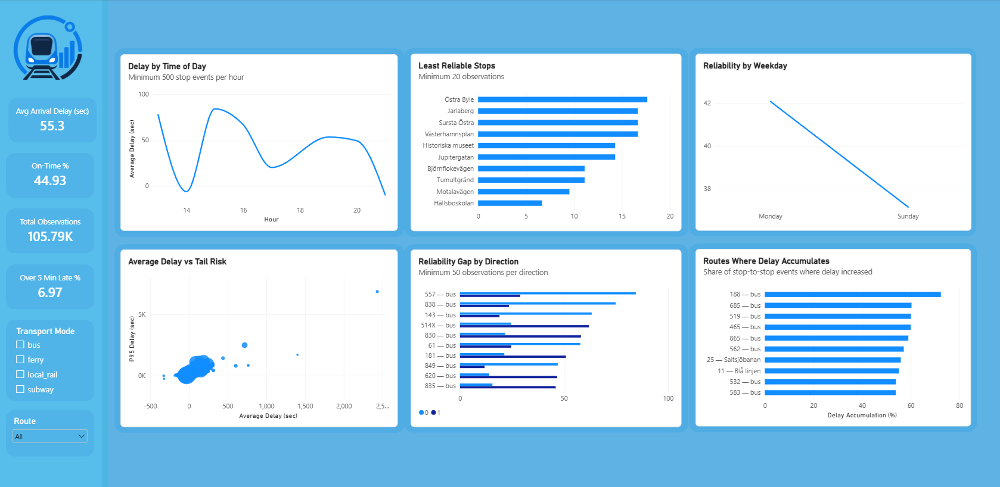

# Stockholm Transit Reliability

A production-inspired data engineering platform for analyzing the reliability of public transport in Stockholm using static schedules and GTFS-Realtime data.

The project combines **Azure Data Lake Storage, Databricks, PySpark, Delta Lake, dbt, Apache Airflow, Snowflake, Power BI, and Streamlit** to build an end-to-end platform spanning historical transit analytics and a live realtime product.

> **Current release: V3 — Live Product**

---

## Table of Contents

- [Overview](#overview)
- [Architecture](#architecture)
- [Data Sources](#data-sources)
- [Historical Pipeline](#historical-pipeline)
  - [Static Pipeline](#static-pipeline)
  - [Realtime Historical Pipeline](#realtime-historical-pipeline)
  - [Gold Publishing](#gold-publishing)
- [Live Product](#live-product)
  - [Live Architecture](#live-architecture)
  - [Live Vehicle Map](#live-vehicle-map)
  - [Vehicle Following](#vehicle-following)
  - [Route Discovery](#route-discovery)
  - [Live Data Limitations](#live-data-limitations)
- [Data Model](#data-model)
- [Orchestration](#orchestration)
- [Data Quality](#data-quality)
- [Analytics](#analytics)
- [Power BI Dashboard](#power-bi-dashboard)
- [Analytical Guardrails](#analytical-guardrails)
- [V2 Findings](#v2-findings)
- [Cost Awareness](#cost-awareness)
- [Technology Stack](#technology-stack)
- [Engineering Decisions](#engineering-decisions)
- [Repository Structure](#repository-structure)
- [Version History](#version-history)
- [Future Development](#future-development)
- [Project Philosophy](#project-philosophy)

---

## Overview

Public transport reliability has both a **historical** and a **live operational** dimension.

Static GTFS describes **what should happen**, while GTFS-Realtime describes **what is happening**.

The project combines both to support two different products:

1. a historical reliability platform for analyzing how Stockholm transit performs over time
2. a live application for exploring active vehicles, routes, destinations, next stops, and realtime status

The platform:

- ingests and archives static GTFS data
- collects GTFS-Realtime TripUpdates
- stores immutable source snapshots in Azure Data Lake Storage
- processes and validates historical data with PySpark in Databricks
- stores trusted Silver datasets using Delta Lake
- preserves historical realtime observations
- models reliability metrics with dbt
- orchestrates the historical realtime pipeline with Apache Airflow
- publishes curated Gold models from Databricks to Snowflake
- uses Snowflake as the analytical serving layer
- presents historical reliability analysis in Power BI
- consumes live GTFS-Realtime VehiclePositions and TripUpdates
- enriches live vehicles using static GTFS context
- serves an interactive live transit application with Streamlit and PyDeck

**V1** established the working end-to-end data platform.

**V2** deepened the analytical layer with **P95 tail risk, route-stop reliability, directional asymmetry, temporal patterns, delay propagation, Snowflake serving, and Power BI**.

**V3** introduces a separate **live transit product** focused on active vehicles and realtime passenger-facing context.

The project is intentionally production-inspired without treating architectural complexity as a goal of its own.

---

## Architecture



V3 separates the system into two paths with different requirements.

### Historical Analytics

The historical pipeline optimizes for:

- durability
- reproducibility
- validation
- historical accumulation
- analytical modeling
- BI consumption

```text
GTFS / GTFS-Realtime
        ↓
      ADLS
        ↓
Databricks / PySpark
        ↓
   Delta Silver
        ↓
     dbt Gold
        ↓
Spark Snowflake Connector
        ↓
    Snowflake
        ↓
     Power BI
```

### Live Product

The live application optimizes for:

- low latency
- current state
- lightweight processing
- frequent refreshes
- interactive exploration

```text
GTFS-Realtime
VehiclePositions + TripUpdates
            ↓
        Python fetch
            ↓
    Decode + enrich
            ↓
       Static GTFS
        trip/route/stop
          context
            ↓
        Streamlit
            ↓
         PyDeck
            ↓
    Interactive live map
```

Apache Airflow remains the control plane for the historical realtime pipeline.

The Streamlit live path is intentionally independent of the historical analytical pipeline.

---

## Data Sources

### Static GTFS

Static GTFS provides transit network and timetable context.

Important entities include:

- routes
- trips
- stops
- stop times
- service information

These datasets allow realtime identifiers to be translated into useful passenger-facing context such as:

- route numbers
- route names
- destinations
- stop names
- trip stop sequences

The historical pipeline and V3 live product use static GTFS for different purposes.

The historical pipeline uses static data as part of its validated analytical scope.

The V3 live application uses SL regional static GTFS directly as a lightweight lookup source for live trip, route, and stop enrichment.

### GTFS-Realtime

The project consumes GTFS-Realtime Protocol Buffer feeds.

The historical pipeline primarily consumes:

```text
TripUpdates
```

V3 additionally consumes:

```text
VehiclePositions
TripUpdates
```

VehiclePositions provides the current geographic state of active vehicles.

TripUpdates provides realtime stop-level information used to determine upcoming stops, estimated arrival times, and delay status.

Instead of keeping only the latest TripUpdates state, the historical pipeline archives timestamped snapshots so an ephemeral realtime source becomes a **historical analytical dataset**.

The V3 live path does the opposite: it deliberately focuses on the **current state** rather than persisting every live position.

---

## Historical Pipeline

### Static Pipeline

```text
Static GTFS
    ↓
Python ingestion
    ↓
Azure Data Lake Storage
    ↓
Databricks Volume
    ↓
PySpark validation & transformation
    ↓
Delta Silver
```

Static Silver tables include trusted entities such as:

```text
routes
trips
stops
stop_times
```

Movement from the archived static GTFS files in ADLS to the Databricks working volume remains manual.

This is intentional: static timetable data changes infrequently, and automating the handoff does not currently solve a significant operational problem.

### Realtime Historical Pipeline

```text
GTFS-Realtime TripUpdates
        ↓
Python ingestion
        ↓
ADLS timestamped snapshots
        ↓
Databricks / PySpark
        ↓
Decode Protocol Buffer
        ↓
Flatten stop-level observations
        ↓
Join against validated trips
        ↓
Deduplicate
        ↓
Idempotency check
        ↓
Append to Delta Silver
```

Raw realtime snapshots are stored using a structure similar to:

```text
ingestion_date=YYYY-MM-DD/
└── hour=HH/
    └── trip_updates_HHMMSS.pb
```

The resulting Silver dataset contains fields including:

```text
trip_id
stop_id
stop_sequence
arrival_time_actual
departure_time_actual
arrival_delay_seconds
departure_delay_seconds
feed_timestamp
start_date
```

Realtime trips must exist in the validated static `trips` table before they are accepted into the analytical pipeline.

### Gold Publishing

dbt builds the analytical Gold models in Databricks.

A dedicated publishing job then reads selected Gold Delta tables and writes them to the `GOLD` schema in Snowflake through the **Spark Snowflake Connector**.

```text
Databricks Gold Delta tables
        ↓
publish_gold_to_snowflake.py
        ↓
Spark Snowflake Connector
        ↓
Snowflake
STOCKHOLM_TRANSIT.GOLD
        ↓
Power BI
```

The following analytical tables are published:

```text
route_reliability
stop_reliability
route_stop_reliability
route_direction_reliability
route_hourly_reliability
route_weekday_reliability
route_delay_propagation
```

Serving tables are written using **overwrite mode**, making each publish a full refresh of the curated analytical serving layer rather than an incremental append.

Snowflake authentication uses key-pair authentication, with the private key retrieved securely from **Databricks Secrets** rather than stored directly in source code.

---

## Live Product

V3 turns the realtime feeds into an interactive transit product.

The application is deployed publicly with Streamlit Community Cloud:

**Live application:** https://sthlmlive.streamlit.app



### Live Architecture

The live application deliberately avoids routing current vehicle positions through the historical data platform.

```text
VehiclePositions
       +
TripUpdates
       +
Static GTFS
       ↓
Python
       ↓
Realtime joins / enrichment
       ↓
Streamlit + PyDeck
       ↓
Live transit map
```

VehiclePositions are matched to static GTFS trips using `trip_id`.

Static trip context resolves the associated:

```text
route_id
route number
route name
destination
transport mode
```

TripUpdates are matched against the live vehicle trip to provide stop-level realtime information.

For each vehicle, the application identifies the first relevant upcoming stop and derives:

- next stop
- estimated arrival
- arrival delay
- realtime availability

The live application refreshes automatically every **10 seconds**.

This provides a responsive live experience while avoiding unnecessary requests on every browser interaction.

### Live Vehicle Map

The default map displays active SL vehicles geographically across the Stockholm region.

Supported user-facing transport modes include:

- bus
- subway
- tram
- ferry

Vehicle markers are visually separated by transport mode.

The interface also displays:

- number of live vehicles
- number of active routes
- percentage of vehicles with realtime stop information
- VehiclePositions feed timestamp
- TripUpdates feed timestamp

The map is implemented with **PyDeck** and rendered inside Streamlit.

### Vehicle Following

Vehicles on the map are interactive.

Selecting a vehicle enters a follow mode:



The map centers on the selected vehicle and continues updating its position as new VehiclePositions snapshots arrive.

The selected vehicle is highlighted visually while the remaining stops for its trip provide route context.

The application displays:

```text
route → destination
transport mode
next stop
estimated arrival
delay status
last live update
```

The next stop is highlighted separately on the map.

Users can stop following the vehicle and return to normal map exploration at any time.

### Route Discovery

The live application supports multiple ways to explore the network.

Users can filter by:

- transport mode
- route

A separate route search supports matching against human-readable route context such as:

- route number
- destination
- route name

Examples include searches such as:

```text
116
Vällingby
Akalla
```

The route catalog is scoped to routes actually observed in SL realtime data during the current application session.

This prevents the broader static GTFS dataset from polluting the interface with unrelated regional routes while allowing route options to remain stable across individual realtime refreshes.

### Live Data Limitations

Realtime products inherit limitations from their upstream feeds.

During V3 development, commuter rail vehicles were observed in the SL VehiclePositions feed with valid:

- vehicle identifiers
- GPS coordinates
- timestamps

but without the `trip_id` required to reliably associate those positions with a scheduled trip and route.

Because the live application depends on deterministic trip-based enrichment, these vehicles cannot currently receive the same reliable route, destination, and stop context as the other supported transport modes.

Rather than introduce a second realtime integration or heuristic matching path solely to work around this upstream limitation, commuter rail is excluded from the V3 user-facing transport modes.

The limitation was verified empirically during development and is treated as an **upstream data-quality constraint**, not silently guessed around inside the application.

V3 therefore prioritizes reliable context over displaying every available GPS coordinate.

---

## Data Model

The historical platform follows a medallion-inspired architecture.

### Raw

ADLS acts as the durable source/archive layer.

Source data is preserved rather than overwritten so ingestion and transformation remain separate concerns and historical snapshots remain recoverable.

### Silver

Silver contains validated operational datasets stored as Delta tables.

The historical realtime grain is:

> **One realtime stop observation per feed snapshot.**

Duplicate observations within a snapshot are removed using:

```text
feed_timestamp
+ trip_id
+ stop_sequence
```

Before writing a snapshot, the pipeline also checks whether its `feed_timestamp` already exists in Silver.

This makes historical realtime processing **append-only and idempotent** across repeated runs.

### Gold

dbt contains the analytical reliability logic.

Important models include:

```text
reliability_stop_observations
route_reliability
stop_reliability
route_stop_reliability
route_direction_reliability
route_hourly_reliability
route_weekday_reliability
delay_propagation_stop_events
route_delay_propagation
```

The analytical layer includes:

- median delay
- P95 arrival delay
- route-stop analysis
- direction-level reliability
- hourly and weekday analysis
- delay accumulation and recovery

Gold models are built first in Databricks and remain the transformation source of truth.

The curated subset required by downstream BI is then published to Snowflake, separating analytical model construction from dashboard serving.

The V3 live application does **not** consume Gold tables because historical aggregates are not the appropriate serving model for current vehicle state.

---

## Orchestration

Apache Airflow orchestrates the historical realtime workflow.

The DAG is designed to run every **10 minutes**:

```text
ingest realtime snapshot
        ↓
transform realtime Silver
        ↓
validate Silver
```

Airflow runs locally through Docker during the current development versions.

Databricks processing is triggered through the Databricks Jobs API, keeping orchestration separate from distributed compute.

The local environment is not kept running continuously during normal development because doing so would consume cloud compute without providing equivalent value.

Continuous cloud-hosted execution is reserved for the V4 production experiment.

The V3 Streamlit application does not use Airflow for live refreshes.

Streamlit directly fetches the current realtime feeds because introducing an orchestration layer between the source and an interactive live application would add latency and complexity without solving a current requirement.

---

## Data Quality

Validation is part of the platform rather than only a dashboard concern.

Static checks include:

- missing identifiers
- missing arrival/departure times
- trip-to-route reference integrity
- stop reference integrity
- duplicate trip/stop-sequence combinations
- stop-sequence validity
- invalid trip stop counts
- GTFS times beyond 24:00

Historical realtime protection includes:

- validated trip scope
- snapshot-level deduplication
- feed-level idempotency
- append-only historical storage

Historical accumulation and duplicate behavior were also sanity-checked directly in Silver before the analytical release was finalized.

V3 adds a different kind of validation challenge.

Live data must be usable immediately, so the application handles incomplete realtime context gracefully.

For example, a vehicle can have a valid live position while temporarily lacking a matching TripUpdate.

In that case, the vehicle can still be represented without inventing an arrival estimate.

---

## Analytics

An observation is considered **on time** when:

```text
|arrival_delay_seconds| <= 60
```

An arrival more than five minutes late is defined as:

```text
arrival_delay_seconds > 300
```

Core metrics include:

- total observations
- average arrival delay
- median arrival delay
- P95 arrival delay
- on-time rate
- over 5 minutes late
- over 10 minutes late

### Tail Risk

Average delay alone can hide severe but less frequent delays.

V2 therefore compares average arrival delay with **P95 delay** to separate typical performance from tail risk.

### Directional Reliability

Opposite directions of the same route can perform very differently.

Direction-level models therefore preserve `direction_id` instead of collapsing both directions into a single route average.

### Route-Stop Reliability

Reliability is also modeled at the route-stop grain.

This matters because the same physical stop can perform differently depending on the route serving it.

### Delay Propagation

V2 evaluates delay changes between consecutive stops on the same trip.

This makes it possible to analyze whether a route tends to:

- accumulate delay
- recover delay
- remain relatively stable

---

## Power BI Dashboard



V2 introduced a Power BI dashboard focused on deeper historical reliability analysis.

Power BI consumes the curated analytical serving tables from **Snowflake**.

The dashboard includes:

- headline reliability KPIs
- delay by time of day
- least reliable route-stop combinations
- average delay vs P95 tail risk
- reliability gap by direction
- weekday reliability
- routes where delay accumulates

Global filters support analysis by:

- **transport mode**
- **route**

Route identifiers are kept unique internally even when different transport modes share the same public route number.

The Power BI KPI calculations were cross-checked against the Gold `route_reliability` model and matched the analytical results at the V2 validation checkpoint.

Power BI remains the **historical analytical product**.

Streamlit serves the **live product**.

The two interfaces answer fundamentally different questions and therefore use different data paths.

---

## Analytical Guardrails

The realtime history is still growing, so minimum sample thresholds are used where small samples could otherwise dominate rankings.

| Analysis | Minimum sample |
|---|---:|
| Route-level findings | 100 observations |
| Direction comparison | 50 observations per direction |
| Route-stop ranking | 20 observations |
| Delay propagation | 50 propagation events |
| Time-of-day analysis | 500 stop events per hour |

These are analytical safeguards for the current dataset, not permanent business rules.

They can be revisited as more realtime history is collected.

---

## V2 Findings

The central analytical lesson from V2 is:

> **Transit reliability cannot be understood from a single aggregate metric.**

### 1. Average Delay Can Hide Tail Risk

Among routes with at least 100 observations, **19 routes** had:

- average arrival delay of no more than **3 minutes**
- P95 arrival delay of at least **10 minutes**

That represented **7.3%** of the qualified routes.

Route **177** was a clear example:

- average delay: approximately **1.4 minutes**
- P95 delay: approximately **18.5 minutes**

A reasonable average therefore does not necessarily imply low passenger-facing risk.

### 2. Route-Level Metrics Can Hide Directional Asymmetry

Among routes with at least 50 observations in each direction, route **557** showed the largest observed on-time gap:

- direction 0: **84.5% on time**
- direction 1: **29.0% on time**
- difference: **55.5 percentage points**

Several other sufficiently observed routes also showed differences above 30 percentage points.

Aggregating both directions into a single route metric would hide this behavior.

### 3. Delay Frequency and Magnitude Tell Different Stories

Route **188** accumulated delay during approximately **72.4%** of observed stop-to-stop propagation events.

However:

- median delay change: **+18 seconds**
- average delay change: approximately **−13 seconds**

This suggests many relatively small delay increases were offset by fewer, larger recoveries.

How **often** delay increases and **how much** it changes are therefore distinct reliability questions.

### Current Analytical Limitation

Temporal coverage is still uneven because the historical realtime pipeline has been run intermittently during development.

Time-of-day analysis is already usable with sample guardrails, but weekday coverage is not yet sufficient for strong network-wide conclusions.

V2 therefore avoids presenting incomplete temporal patterns as established behavior.

---

## Cost Awareness

Cloud cost is treated as an engineering constraint.

Azure Cost Management showed that Databricks compute was the dominant Azure service cost during development.

The Databricks SQL warehouse was initially configured as **Small** and was later downsized to **2X-Small** after the larger configuration proved unnecessary for the project's development and analytical-query workload.

The smaller warehouse remained sufficient for:

- SQL validation
- development queries
- analytical inspection of Gold models

Power BI consumption is served separately through Snowflake and therefore should not be attributed to the Databricks SQL Warehouse.

At the V2 checkpoint, cumulative Azure Databricks development spend was approximately **SEK 301**.

Daily Databricks spending was substantially lower after right-sizing, although varying runtime between development days means the change is not presented as a controlled percentage saving.

The engineering principle is:

> **Measure actual usage, identify overprovisioned resources, and right-size infrastructure to the workload.**

V3 follows the same principle architecturally.

Serving live vehicle positions does not require spinning up Databricks compute, querying Snowflake, or operating another persistent data-processing service.

The live path therefore remains lightweight.

---

## Technology Stack

| Technology | Purpose |
|---|---|
| **Python** | GTFS ingestion, realtime feed processing, and live application logic |
| **Azure Data Lake Storage Gen2** | Durable raw/archive storage |
| **Databricks** | Historical processing and transformation platform |
| **Apache Spark / PySpark** | Distributed-style transformation and validation |
| **Delta Lake** | Trusted Silver and Gold analytical storage |
| **Unity Catalog** | Table organization and governance |
| **dbt** | Gold-layer analytical modeling and testing |
| **Apache Airflow** | Historical realtime workflow orchestration |
| **Docker** | Reproducible local Airflow environment |
| **Databricks SQL** | Development, validation, and ad hoc analytical queries |
| **Spark Snowflake Connector** | Gold publishing from Databricks to Snowflake |
| **Snowflake** | Analytical serving layer for downstream BI |
| **Power BI** | Historical reliability dashboard |
| **Streamlit** | Live transit web application |
| **PyDeck** | Interactive live vehicle map |
| **GTFS / GTFS-Realtime** | Transit data standards |
| **Azure Cost Management** | Cloud-cost visibility |

---

## Engineering Decisions

The project is not intended to maximize technology count.

Each component should either solve a real requirement or serve an explicit learning objective.

### Why Spark and Databricks?

**Spark was not strictly required by the data volume in this project.**

The static GTFS dataset contains millions of stop-time records, but the workload could have been processed using simpler single-machine tooling.

Spark and Databricks were deliberately selected because a major project objective was to develop practical experience with:

- distributed data-processing concepts
- PySpark transformations
- Spark execution
- Delta Lake
- Databricks jobs and compute

Spark is therefore used as the project's real processing engine rather than as an isolated technology demonstration, while being explicitly acknowledged as **learning-driven rather than required by scale**.

This is intentional learning overengineering, not an architectural claim that simpler tooling would have been insufficient.

### Why ADLS and Delta Lake?

The two storage layers serve different responsibilities.

**ADLS Raw** preserves source data and historical snapshots.

**Delta Silver** provides structured and validated operational tables for downstream processing.

Keeping these responsibilities separate preserves source truth and makes the pipeline easier to recover and reason about.

### Why dbt?

PySpark handles operational transformation and validation.

dbt handles analytical modeling and reliability definitions.

This separates data engineering logic from analytical business logic and allows the analytical layer to evolve without redesigning the ingestion pipeline.

### Why Snowflake?

Databricks and Snowflake serve different responsibilities in the historical architecture.

**Databricks** is the primary processing and transformation environment. PySpark processes the operational data, Delta Lake stores trusted datasets, and dbt builds the analytical Gold models.

**Snowflake** acts as the dedicated analytical serving layer consumed by Power BI.

```text
Databricks Gold
      ↓
PySpark publish job
      ↓
Spark Snowflake Connector
      ↓
Snowflake GOLD
      ↓
Power BI
```

This separates data-engineering workloads from downstream BI consumption and provides practical experience integrating two commonly used analytical platforms.

As with Spark, this separation is **not required by the scale of the current workload**.

A simpler architecture could serve Power BI directly from Databricks.

Snowflake is deliberately included as a learning-driven architectural decision, while still being assigned a clear responsibility rather than added as an unused technology.

### Why Full-Refresh the Snowflake Serving Layer?

The current Gold serving tables are small analytical aggregates rather than large event-level datasets.

Replacing each Snowflake table during publishing is simpler to reason about than implementing incremental synchronization between two platforms.

This keeps Databricks Gold as the analytical source of truth while Snowflake contains a clean serving copy for Power BI.

If the serving datasets become substantially larger or publishing becomes more frequent, incremental loading can be reconsidered.

### Why Airflow?

The historical realtime workflow contains multiple dependent stages, repeated execution, ordering requirements, and validation.

That creates a genuine orchestration problem.

Airflow coordinates that workflow rather than being included only for technology coverage.

### Why Power BI?

V1 used Databricks AI/BI to prove the first analytical slice.

V2 required a richer analytical product with route filtering, directional comparisons, tail-risk analysis, propagation analysis, and multiple coordinated views.

Power BI became the historical presentation layer, consuming curated analytical tables from Snowflake.

### Why a Separate Live Path?

Historical analytics and a live transit application have different requirements.

The historical pipeline needs:

```text
durable storage
validation
historical accumulation
analytical transformations
reproducibility
```

The live application needs:

```text
fresh state
low latency
lightweight joins
frequent refreshes
interactive serving
```

Routing every live GPS update through:

```text
ADLS
→ Databricks
→ Delta
→ dbt
→ Snowflake
→ application
```

would add infrastructure and latency without solving a V3 requirement.

The live product therefore consumes the realtime feeds directly and performs only the enrichment required to serve the application.

This is a deliberate architectural boundary rather than a shortcut.

### Why Streamlit?

V3 required an interactive product rather than another analytical dashboard.

The application needed:

- map interaction
- live refreshes
- route filtering
- route search
- clickable vehicles
- persistent vehicle-following state
- realtime status presentation

Streamlit provides the application layer while PyDeck handles the geographic visualization.

This keeps the V3 serving architecture lightweight while still supporting the required product behavior.

### Why Not Kafka or Streaming Infrastructure?

The source already exposes frequently updated realtime state.

The V3 product does not currently require:

- event replay
- multiple independent realtime consumers
- high-throughput event processing
- distributed stream transformations
- sub-second latency

Introducing Kafka or another streaming platform would therefore create infrastructure without a matching requirement.

If future requirements change, that decision can be revisited.

### Why Not Persist VehiclePositions?

V3 asks:

> **Where are the vehicles now?**

The historical analytical pipeline asks:

> **How reliable has the network been over time?**

Persisting every GPS coordinate is not necessary to answer the current V3 product question.

VehiclePositions are therefore treated as transient live state rather than another historical dataset.

### Why Not Automate Everything?

Automation is added when it removes an actual operational problem.

For example, the static ADLS-to-Databricks-volume handoff remains manual because automating an infrequent operation would currently add more complexity than value.

The same principle applies to infrastructure-as-code, CI/CD, monitoring platforms, streaming infrastructure, and other technologies:

> **A technology is introduced when a concrete requirement justifies it, not because the project needs another logo.**

---

## Repository Structure

```text
stockholm-transit-reliability/
│
├── airflow/
│   ├── dags/
│   │   └── stockholm_realtime_pipeline.py
│   ├── Dockerfile
│   ├── docker-compose.yml
│   └── requirements.txt
│
├── dbt/
│   ├── models/
│   │   ├── daily_reliability_metrics.sql
│   │   ├── delay_propagation_stop_events.sql
│   │   ├── hourly_reliability_patterns.sql
│   │   ├── reliability_stop_events.sql
│   │   ├── reliability_stop_observations.sql
│   │   ├── route_delay_propagation.sql
│   │   ├── route_direction_reliability.sql
│   │   ├── route_hourly_reliability.sql
│   │   ├── route_reliability.sql
│   │   ├── route_stop_reliability.sql
│   │   ├── route_weekday_reliability.sql
│   │   ├── stop_reliability.sql
│   │   ├── schema.yml
│   │   └── sources.yml
│   ├── tests/
│   └── dbt_project.yml
│
├── docs/
│   ├── architecture-v1.png
│   ├── architecture-v2.png
│   ├── architecture-v3.png
│   ├── dashboard-v1.png
│   ├── dashboard-v2.png
│   ├── streamlit_gps1.png
│   └── streamlit_gps2.png
│
├── src/
│   ├── ingestion/
│   │   ├── ingest_realtime.py
│   │   └── ingest_static.py
│   │
│   ├── transformations/
│   │   ├── transform_realtime.py
│   │   └── transform_static_gtfs.py
│   │
│   ├── validation/
│   │   ├── validate_realtime_silver.py
│   │   ├── validate_silver.py
│   │   └── validate_timetable_handshake.py
│   │
│   ├── publish/
│   │   └── publish_gold_to_snowflake.py
│   │
│   ├── live/
│   │   ├── app.py
│   │   ├── inspect_missing_trip_vehicles.py
│   │   ├── inspect_trip_updates.py
│   │   ├── inspect_vehicle_positions.py
│   │   └── inspect_vehicle_route_context.py
│   │
│   ├── main.py
│   └── realtime.py
│
├── .gitignore
├── requirements.txt
└── README.md
```

Raw and generated datasets are excluded from version control.

Local credentials and API keys are never committed.

The Streamlit deployment receives its API credentials through encrypted application secrets.

Local connectivity/debugging scripts are also kept outside the production project structure where appropriate.

---

## Version History

### V1 — Working Platform ✅

V1 established the initial end-to-end foundation:

```text
GTFS / GTFS-RT
      ↓
Ingestion
      ↓
ADLS Raw
      ↓
Databricks / PySpark
      ↓
Delta Silver
      ↓
dbt Gold
      ↓
Databricks SQL
      ↓
Dashboard
```

It also introduced the Airflow-controlled realtime workflow, historical snapshot preservation, validation, deduplication, and idempotent processing.

### V2 — Analytical Depth ✅

V2 expanded the analytical capability of the working V1 platform.

Key additions included:

- longer realtime history
- median and P95 reliability metrics
- tail-risk analysis
- route-stop analysis
- direction-level analysis
- hourly and weekday analysis
- delay propagation and recovery
- analytical sample-size guardrails
- Snowflake analytical serving layer
- Gold publishing through the Spark Snowflake Connector
- Power BI dashboard
- Gold-to-serving-to-dashboard validation
- cloud-cost inspection and compute right-sizing
- updated V2 architecture documentation

The V2 analytical serving path became:

```text
dbt Gold in Databricks
        ↓
Snowflake
        ↓
Power BI
```

V2 intentionally improved **what can be learned from the system** while adding infrastructure only where it had a defined responsibility or explicit learning objective.

### V3 — Live Product ✅

V3 extended the project from historical analytics into an interactive realtime product.

Key additions include:

- GTFS-Realtime VehiclePositions integration
- TripUpdates integration for live stop context
- static GTFS enrichment
- live vehicle GPS map
- bus, subway, tram, and ferry modes
- transport-mode filtering
- route filtering
- route search
- human-readable route labels and destinations
- clickable live vehicles
- vehicle-following mode
- moving vehicle position updates
- trip stop context
- next-stop highlighting
- estimated arrival
- realtime delay status
- live-update age
- automatic 10-second refresh
- Streamlit application
- PyDeck map visualization
- public Streamlit Cloud deployment
- V3 architecture documentation
- explicit handling of upstream commuter-rail data limitations

The V3 live path is:

```text
VehiclePositions + TripUpdates
            ↓
          Python
            ↓
      Static GTFS join
            ↓
    Realtime enrichment
            ↓
        Streamlit
            ↓
         PyDeck
            ↓
     Live transit map
```

V3 deliberately keeps the live product independent from the historical analytical serving path.

This prevents infrastructure designed for durable historical analytics from being unnecessarily inserted into a latency-sensitive live application.

---

## Future Development

The roadmap is intentionally versioned to prevent scope creep.

### V4 — Production Experiment

The next version focuses on operating the historical data platform independently from the local development machine.

Planned work includes:

- cloud-hosted Airflow
- laptop-independent orchestration
- limited 24/7 realtime collection
- cloud-cost monitoring
- stable multi-day operation
- operational failure/recovery observation

V4 is intentionally an **operational experiment**, not a mandate to rebuild the architecture.

The objective is to learn what changes when a pipeline moves from manually supervised development to persistent operation.

### Final — Portfolio Release

- final architecture
- documentation review
- final analytical findings
- costs and trade-offs
- screenshots and live demo
- repository cleanup
- final release

New technologies will only be added when one of these requirements creates a concrete need for them.

---

## Project Philosophy

This project is intentionally built under realistic constraints.

Cloud resources are finite. Development time is finite. Scope is finite.

The objective is not to build the largest possible system, but to make deliberate decisions while balancing:

- learning value
- analytical value
- product value
- data quality
- latency
- cloud cost
- maintainability
- operational complexity
- project scope

Some decisions in this project — most notably the use of **Spark, Databricks, and the separate Snowflake serving layer** — are intentionally **learning-driven**.

The project does not claim that its current data volume requires this architecture.

Instead, these technologies are used in real roles within the pipeline so their operational characteristics, integration boundaries, costs, and trade-offs can be explored in practice.

V3 also demonstrates the opposite decision.

When the live product introduced a new requirement, existing technologies were **not automatically reused**.

Databricks, Spark, dbt, Snowflake, and Airflow were intentionally kept out of the live serving path because they did not solve the live application's current requirements.

The result is a project with two architectures optimized for two different questions:

```text
Historical:
How reliable has Stockholm transit been?

Live:
What is happening in the network right now?
```

**V1 established the working platform.**

**V2 deepened the analytics and introduced a dedicated analytical serving layer.**

**V3 turned realtime data into an interactive live product.**

**V4 will test what it takes to operate the platform independently and continuously.**

> **The project evolves because the problem evolves — not because more technology can be added.**