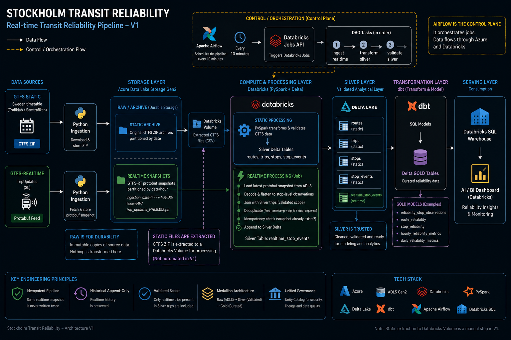
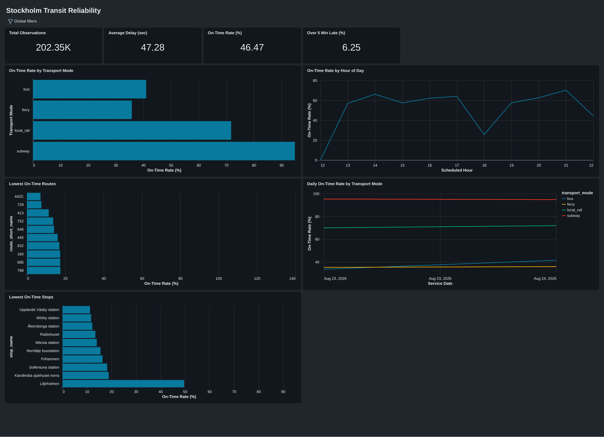

# Stockholm Transit Reliability

A production-inspired data engineering platform for analyzing the reliability of public transport in Stockholm using static schedules and realtime GTFS data.

The project combines **Azure Data Lake Storage, Databricks, Apache Spark, Delta Lake, dbt, Apache Airflow, and Databricks SQL** to build an end-to-end pipeline from raw transit feeds to reliability analytics and an interactive dashboard.

> **Current release: V1**

---

## Table of Contents

- [Overview](#overview)
- [Architecture](#architecture)
- [Data Sources](#data-sources)
- [Pipeline](#pipeline)
  - [Static GTFS Pipeline](#static-gtfs-pipeline)
  - [Realtime GTFS Pipeline](#realtime-gtfs-pipeline)
- [Data Model](#data-model)
- [Orchestration](#orchestration)
- [Data Quality and Reliability](#data-quality-and-reliability)
- [Analytics Layer](#analytics-layer)
- [Dashboard](#dashboard)
- [Technology Stack](#technology-stack)
- [Repository Structure](#repository-structure)
- [Engineering Decisions](#engineering-decisions)
- [V1 Scope](#v1-scope)
- [Future Development](#future-development)

---

## Overview

Public transport reliability cannot be understood from schedules alone.

A scheduled timetable describes **what should happen**, while GTFS-Realtime describes **what is happening**. This project combines both to create a historical analytical dataset capable of measuring how reliably public transport operates across routes, stops, transport modes, dates, and hours of the day.

The V1 platform:

- ingests static GTFS timetable data
- collects GTFS-Realtime TripUpdates
- archives raw source data in Azure Data Lake Storage
- processes data using PySpark in Databricks
- stores validated analytical datasets as Delta tables
- joins realtime observations against the validated static transit network
- preserves historical realtime observations
- models reliability metrics using dbt
- orchestrates the realtime pipeline with Apache Airflow
- exposes analytical datasets through Databricks SQL
- presents reliability metrics in an interactive dashboard

The project is designed as a **production-inspired system**, while deliberately avoiding infrastructure and complexity that do not yet solve a real problem.

---

## Architecture



The architecture separates the system into three major concerns:

**Raw storage** preserves source data and historical realtime snapshots.

**Silver processing** converts raw transit data into validated, typed and queryable Delta datasets.

**Gold modeling** transforms those datasets into reliability-focused analytical models used by the dashboard.

Apache Airflow operates separately as the orchestration layer for the realtime pipeline.

---

## Data Sources

### Static GTFS

Static GTFS provides the reference transit network and timetable data used by the platform.

Important entities include:

- routes
- trips
- stops
- stop times
- service information

The static dataset provides the reference needed to determine which realtime observations belong to the transit network being analyzed.

### GTFS-Realtime

The realtime pipeline consumes **TripUpdates** encoded as GTFS-Realtime Protocol Buffers.

Each snapshot can contain updated arrival and departure information for many trips and stops.

Instead of keeping only the newest state, the platform archives timestamped snapshots so realtime data can become a **historical analytical dataset**.

---

## Pipeline

The platform contains separate static and realtime processing paths that converge in the analytical layers.

### Static GTFS Pipeline

Static GTFS data is ingested and archived in Azure Data Lake Storage.

The current V1 processing workflow uses extracted GTFS files available through a Databricks Unity Catalog Volume.

PySpark transformations convert the source files into validated Delta Silver tables.

The static Silver layer provides trusted reference entities such as:

```text
routes
trips
stops
stop_times
```

These datasets establish the valid Stockholm transit scope used by downstream realtime processing.

> In V1, movement from the archived static GTFS source in ADLS to the Databricks working volume is not fully automated. This is an intentional V1 boundary rather than being hidden behind unnecessary infrastructure.

### Realtime GTFS Pipeline

Realtime processing follows a historical snapshot architecture.

```text
GTFS-Realtime TripUpdates
        ↓
Python ingestion
        ↓
Azure Data Lake Storage
        ↓
Timestamped protobuf snapshots
        ↓
Databricks / PySpark
        ↓
Decode Protocol Buffer
        ↓
Flatten stop-level observations
        ↓
Join against validated static trips
        ↓
Deduplicate observations
        ↓
Idempotency check
        ↓
Append to Delta Silver
```

Raw snapshots are stored using a time-partitioned structure similar to:

```text
ingestion_date=YYYY-MM-DD/
└── hour=HH/
    └── trip_updates_HHMMSS.pb
```

The realtime processor discovers the latest available snapshot directly from ADLS.

Each Protocol Buffer feed is flattened into stop-level observations containing fields such as:

```text
trip_id
stop_id
stop_sequence
arrival_time_actual
departure_time_actual
arrival_delay_seconds
departure_delay_seconds
feed_timestamp
start_date
```

Realtime trips are then joined against the validated static Silver `trips` dataset.

This prevents observations outside the validated transit scope from entering the analytical model.

---

## Data Model

The project follows a medallion-inspired architecture.

### Raw

Azure Data Lake Storage acts as the durable raw and archive layer.

Raw source data is preserved rather than overwritten, allowing ingestion and transformation to remain separate concerns.

### Silver

Silver contains validated operational datasets stored using Delta Lake.

The layer contains both static transit entities and historical realtime observations.

The realtime observation grain is:

> **One realtime stop observation per feed snapshot.**

Duplicate realtime observations are removed using:

```text
feed_timestamp
+ trip_id
+ stop_sequence
```

The realtime Silver table is append-only across new snapshots.

### Gold

dbt transforms Silver data into analytics-oriented reliability models.

Current V1 models include:

```text
reliability_stop_observations
route_reliability
stop_reliability
hourly_reliability_patterns
daily_reliability_metrics
```

This separates operational transformation from analytical business logic.

---

## Orchestration

Apache Airflow orchestrates the realtime pipeline.

The DAG is designed to run every **10 minutes** and coordinates the major realtime workflow stages:

```text
ingest realtime snapshot
        ↓
process realtime Silver
        ↓
validate resulting data
```

Airflow runs locally through Docker in V1.

Databricks processing is triggered through the Databricks Jobs API, allowing orchestration and distributed compute to remain separate concerns.

This means Airflow controls **when and in what order work happens**, while Databricks and Spark perform the actual distributed data processing.

The local Airflow environment is intentionally not kept running continuously during development in order to avoid unnecessary cloud compute usage.

---

## Data Quality and Reliability

Reliability is treated as part of the pipeline rather than only as a dashboard concern.

### Static validation

Static GTFS profiling and validation checks include:

- missing trip identifiers
- missing stop identifiers
- missing arrival/departure times
- trip-to-route reference integrity
- stop-to-stop-times reference integrity
- duplicate trip and stop sequence combinations
- stop sequence validity
- trips with invalid stop counts
- GTFS times extending beyond 24:00

The source dataset contains millions of stop-time records, making Spark useful both as a learning objective and as the distributed processing engine for the project.

### Realtime validation

Realtime processing includes several defensive mechanisms.

**Validated scope**

Realtime trips must exist in the static Silver `trips` dataset.

**Deduplication**

Duplicate observations inside a snapshot are removed using the realtime observation key.

**Idempotency**

Before writing a snapshot, the pipeline checks whether its `feed_timestamp` already exists in Silver.

If it does, the write is skipped.

This allows the same snapshot to be processed repeatedly without duplicating historical data.

**Historical append**

New snapshots are appended rather than overwriting existing observations.

This converts an ephemeral realtime feed into a dataset that can be analyzed historically.

---

## Analytics Layer

The Gold layer focuses on questions that can help explain transit reliability rather than simply displaying raw operational data.

Current analytical dimensions include:

- transport mode
- route
- stop
- service date
- scheduled hour

Core reliability metrics include:

- total observations
- average arrival delay
- on-time rate
- percentage of arrivals more than five minutes late

For V1, an observation is considered **on time** when its absolute arrival deviation is no greater than 60 seconds.

```text
|arrival_delay_seconds| <= 60
```

A significantly late observation is defined as:

```text
arrival_delay_seconds > 300
```

The analytical models allow the dashboard to answer questions such as:

- Which transport modes are most reliable?
- Which routes have the lowest on-time performance?
- Which stops experience the poorest reliability?
- How does reliability change throughout the day?
- How does reliability change across service dates?
- How do reliability patterns differ between transport modes?

---

## Dashboard



The V1 Databricks AI/BI dashboard provides an interactive view of the Gold reliability models.

Headline KPIs include:

- **Total Observations**
- **Average Delay**
- **On-Time Rate**
- **Over 5 Minutes Late**

The dashboard also includes:

- on-time rate by transport mode
- on-time rate by scheduled hour
- lowest-performing routes
- lowest-performing stops
- daily reliability by transport mode

A global **Transport Mode** filter allows the dashboard to switch between the complete network and individual modes such as:

```text
bus
ferry
local rail
subway
```

The KPI calculations operate on observation-level data so aggregate percentages remain correctly weighted when global filters are applied.

---

## Technology Stack

| Technology | Purpose |
|---|---|
| **Python** | Ingestion, pipeline logic and GTFS-Realtime processing |
| **Azure Data Lake Storage Gen2** | Durable raw/archive storage |
| **Databricks** | Distributed data platform and compute environment |
| **Apache Spark / PySpark** | Distributed transformation and validation |
| **Delta Lake** | Reliable Silver and Gold analytical storage |
| **Unity Catalog** | Table organization and governance |
| **dbt** | Gold-layer analytical modeling and testing |
| **Apache Airflow** | Realtime workflow orchestration |
| **Docker** | Reproducible local Airflow environment |
| **Databricks SQL** | Analytical query and serving layer |
| **Databricks AI/BI** | Interactive reliability dashboard |
| **GTFS / GTFS-Realtime** | Static and realtime transit data standards |
| **Azure Identity / SDKs** | Programmatic access to Azure storage |

---

## Repository Structure

```text
stockholm-transit-reliability/
│
├── airflow/
│   ├── dags/
│   │   └── stockholm_realtime_pipeline.py
│   ├── Dockerfile
│   ├── docker-compose.yml
│   └── requirements.txt
│
├── dbt/
│   ├── models/
│   │   ├── daily_reliability_metrics.sql
│   │   ├── hourly_reliability_patterns.sql
│   │   ├── reliability_stop_observations.sql
│   │   ├── route_reliability.sql
│   │   └── stop_reliability.sql
│   ├── tests/
│   └── dbt_project.yml
│
├── docs/
│   ├── architecture-v1.png
│   └── dashboard-v1.png
│
├── src/
│   ├── ingestion/
│   │   ├── ingest_realtime.py
│   │   └── ingest_static.py
│   │
│   ├── transformations/
│   │   ├── transform_realtime.py
│   │   └── transform_static_gtfs.py
│   │
│   ├── validation/
│   │   ├── validate_realtime_silver.py
│   │   ├── validate_silver.py
│   │   └── validate_timetable_handshake.py
│   │
│   ├── main.py
│   └── realtime.py
│
├── .gitignore
└── README.md
```

---

## Engineering Decisions

A major objective of the project is not simply to use as many technologies as possible.

Each component should solve a specific problem.

### Why Spark?

The static GTFS dataset contains millions of stop-time records and provides a realistic environment for learning distributed transformation and validation.

Spark is used as the project's primary processing engine rather than introducing it only as a technology demonstration.

### Why ADLS and Delta Lake?

The two storage layers serve different purposes.

**ADLS Raw** preserves source data and historical snapshots.

**Delta Silver/Gold** provides structured analytical tables optimized for transformation and querying.

Keeping these responsibilities separate makes the pipeline easier to reason about and allows raw data to remain recoverable.

### Why dbt?

Spark handles operational transformation and validation.

dbt handles analytical modeling.

This keeps reliability definitions and Gold-layer SQL models separate from ingestion and lower-level data processing.

### Why Airflow?

The realtime pipeline contains multiple dependent stages and is designed to execute repeatedly.

That creates a genuine orchestration requirement.

Airflow therefore coordinates the workflow rather than being introduced solely to add another technology to the stack.

### Why Docker?

The Airflow environment contains several services and dependencies.

Docker provides a reproducible local runtime without requiring Airflow components to be configured individually on the host machine.

### Why not automate everything?

V1 intentionally leaves some infrastructure and deployment processes manual.

Automation is added when it removes an actual operational problem.

The goal is to avoid turning the platform into a collection of technologies that increase complexity without improving the system.

---

## V1 Scope

V1 establishes the first complete vertical slice of the platform:

```text
Source
  ↓
Ingestion
  ↓
Raw storage
  ↓
Distributed processing
  ↓
Validated Silver
  ↓
Analytical modeling
  ↓
Gold
  ↓
SQL serving
  ↓
Dashboard
```

It also establishes the realtime orchestration path:

```text
Airflow
   ↓
Realtime ingestion
   ↓
Databricks processing
   ↓
Validation
```

V1 is intentionally **not the final form of the project**.

The objective of this release is to prove that the architecture works end-to-end and establish a stable foundation for future iterations.

### Intentionally outside V1

V1 does not attempt to solve every future requirement.

Examples of intentionally deferred work include:

- continuously hosted Airflow
- fully automated static ingestion-to-processing handoff
- production CI/CD where it does not yet provide sufficient value
- infrastructure-as-code without a concrete infrastructure-management need
- long-term realtime history
- advanced geospatial visualization
- vehicle-position tracking
- extensive operational monitoring

These are potential future capabilities rather than requirements for declaring V1 complete.

---

## Future Development

Future releases can build on the V1 foundation without changing the project's core architecture unnecessarily.

Potential directions include:

**Longer realtime collection**

Run the pipeline continuously for several days to build a richer historical dataset and expose more meaningful temporal reliability patterns.

**Cloud-hosted orchestration**

Move the Airflow scheduler from the local Docker environment to cloud-hosted infrastructure for a limited production-style collection period.

**Geospatial analysis**

Combine stop coordinates and realtime data to visualize reliability spatially across Stockholm.

**Live vehicle tracking**

Use vehicle-position data to build an interactive Streamlit map showing transit movement and operational state.

**Deeper reliability analytics**

Investigate patterns such as:

- peak vs off-peak reliability
- route-level volatility
- recurring problem stops
- reliability by direction
- delay propagation across a trip
- differences between scheduled and observed travel behavior

Future features will be added based on analytical or operational value rather than technology count.

---

## Project Philosophy

This project is intentionally built under realistic constraints.

Cloud resources are finite. Development time is finite. Scope is finite.

The goal is therefore not to build the largest possible system, but to make deliberate engineering decisions while balancing:

- technical capability
- analytical value
- cloud cost
- development time
- maintainability
- project scope

The architecture is expected to evolve across releases.

V1 establishes the foundation.

Later versions should improve it because new requirements justify the change — not because more technology can be added.