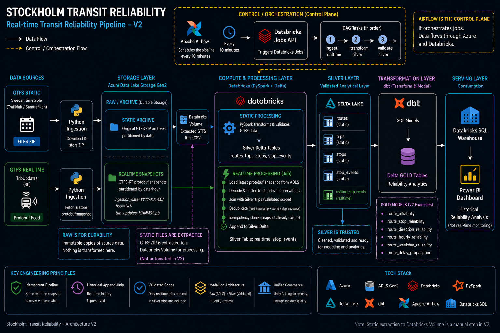

# Stockholm Transit Reliability

A production-inspired data engineering platform for analyzing the reliability of public transport in Stockholm using static schedules and GTFS-Realtime data.

The project combines **Azure Data Lake Storage, Databricks, PySpark, Delta Lake, dbt, Apache Airflow, Databricks SQL, and Power BI** to build an end-to-end pipeline from raw transit feeds to historical reliability analytics.

> **Current release: V2 — Analytical Depth**

---

## Table of Contents

- [Overview](#overview)
- [Architecture](#architecture)
- [Data Sources](#data-sources)
- [Pipeline](#pipeline)
  - [Static Pipeline](#static-pipeline)
  - [Realtime Pipeline](#realtime-pipeline)
- [Data Model](#data-model)
- [Orchestration](#orchestration)
- [Data Quality](#data-quality)
- [Analytics](#analytics)
- [Power BI Dashboard](#power-bi-dashboard)
- [Analytical Guardrails](#analytical-guardrails)
- [V2 Findings](#v2-findings)
- [Cost Awareness](#cost-awareness)
- [Technology Stack](#technology-stack)
- [Engineering Decisions](#engineering-decisions)
- [Repository Structure](#repository-structure)
- [Version History](#version-history)
- [Future Development](#future-development)
- [Project Philosophy](#project-philosophy)

---

## Overview

Public transport reliability cannot be understood from schedules alone.

Static GTFS describes **what should happen**, while GTFS-Realtime describes **what is happening**. This project combines both to preserve realtime observations historically and analyze reliability across routes, stops, directions, transport modes, weekdays, and hours of the day.

The platform:

- ingests and archives static GTFS data
- collects GTFS-Realtime TripUpdates
- stores immutable source snapshots in Azure Data Lake Storage
- processes and validates data with PySpark in Databricks
- stores trusted Silver datasets using Delta Lake
- preserves historical realtime observations
- models reliability metrics with dbt
- orchestrates the realtime pipeline with Apache Airflow
- serves analytical models through Databricks SQL
- presents historical reliability analysis in Power BI

**V1** established the working end-to-end platform.

**V2** keeps that architecture and focuses on deeper analysis: **P95 tail risk, route-stop reliability, directional asymmetry, temporal patterns, and delay propagation**.

The project is intentionally production-inspired without treating architectural complexity as a goal of its own.

---

## Architecture



The system separates four main concerns:

**Raw storage**  
Azure Data Lake Storage preserves static source files and timestamped GTFS-Realtime snapshots.

**Silver processing**  
Databricks and PySpark convert source data into validated, typed Delta datasets.

**Gold modeling**  
dbt transforms trusted Silver data into reliability-focused analytical models.

**Serving and visualization**  
Databricks SQL serves the Gold layer to Power BI.

Apache Airflow operates separately as the **control plane**, coordinating when realtime jobs execute and in what order.

---

## Data Sources

### Static GTFS

Static GTFS provides the reference transit network and timetable.

Important entities include:

- routes
- trips
- stops
- stop times
- service information

These datasets define the validated transit scope used by downstream realtime processing.

### GTFS-Realtime

The realtime pipeline consumes **TripUpdates** encoded as Protocol Buffers.

Instead of keeping only the latest feed state, timestamped snapshots are archived so an ephemeral realtime source becomes a **historical analytical dataset**.

---

## Pipeline

### Static Pipeline

```text
Static GTFS
    ↓
Python ingestion
    ↓
Azure Data Lake Storage
    ↓
Databricks Volume
    ↓
PySpark validation & transformation
    ↓
Delta Silver
```

Static Silver tables include trusted entities such as:

```text
routes
trips
stops
stop_times
```

Movement from the archived static GTFS files in ADLS to the Databricks working volume remains manual in V2.

This is intentional: static timetable data changes infrequently, and automating the handoff does not currently solve a significant operational problem.

### Realtime Pipeline

```text
GTFS-Realtime TripUpdates
        ↓
Python ingestion
        ↓
ADLS timestamped snapshots
        ↓
Databricks / PySpark
        ↓
Decode Protocol Buffer
        ↓
Flatten stop-level observations
        ↓
Join against validated trips
        ↓
Deduplicate
        ↓
Idempotency check
        ↓
Append to Delta Silver
```

Raw realtime snapshots are stored using a structure similar to:

```text
ingestion_date=YYYY-MM-DD/
└── hour=HH/
    └── trip_updates_HHMMSS.pb
```

The resulting Silver dataset contains fields including:

```text
trip_id
stop_id
stop_sequence
arrival_time_actual
departure_time_actual
arrival_delay_seconds
departure_delay_seconds
feed_timestamp
start_date
```

Realtime trips must exist in the validated static `trips` table before they are accepted into the analytical pipeline.

---

## Data Model

The project follows a medallion-inspired architecture.

### Raw

ADLS acts as the durable source/archive layer.

Source data is preserved rather than overwritten so ingestion and transformation remain separate concerns and historical snapshots remain recoverable.

### Silver

Silver contains validated operational datasets stored as Delta tables.

The realtime grain is:

> **One realtime stop observation per feed snapshot.**

Duplicate observations within a snapshot are removed using:

```text
feed_timestamp
+ trip_id
+ stop_sequence
```

Before writing a snapshot, the pipeline also checks whether its `feed_timestamp` already exists in Silver.

This makes historical realtime processing **append-only and idempotent** across repeated runs.

### Gold

dbt contains the analytical reliability logic.

Important V2 models include:

```text
reliability_stop_observations
route_reliability
stop_reliability
route_stop_reliability
route_direction_reliability
route_hourly_reliability
route_weekday_reliability
delay_propagation_stop_events
route_delay_propagation
```

V2 extends the analytical layer beyond basic averages with:

- median delay
- P95 arrival delay
- route-stop analysis
- direction-level reliability
- hourly and weekday analysis
- delay accumulation and recovery

---

## Orchestration

Apache Airflow orchestrates the realtime workflow.

The DAG is designed to run every **10 minutes**:

```text
ingest realtime snapshot
        ↓
transform realtime Silver
        ↓
validate Silver
```

Airflow runs locally through Docker during the current development versions.

Databricks processing is triggered through the Databricks Jobs API, keeping orchestration separate from distributed compute.

The local environment is not kept running continuously during normal development because doing so would consume cloud compute without providing equivalent value.

Continuous cloud-hosted execution is reserved for a later production experiment.

---

## Data Quality

Validation is part of the pipeline rather than only a dashboard concern.

Static checks include:

- missing identifiers
- missing arrival/departure times
- trip-to-route reference integrity
- stop reference integrity
- duplicate trip/stop-sequence combinations
- stop-sequence validity
- invalid trip stop counts
- GTFS times beyond 24:00

Realtime protection includes:

- validated trip scope
- snapshot-level deduplication
- feed-level idempotency
- append-only historical storage

Historical accumulation and duplicate behavior were also sanity-checked directly in Silver during V2 development before the analytical release was finalized.

---

## Analytics

An observation is considered **on time** when:

```text
|arrival_delay_seconds| <= 60
```

An arrival more than five minutes late is defined as:

```text
arrival_delay_seconds > 300
```

Core metrics include:

- total observations
- average arrival delay
- median arrival delay
- P95 arrival delay
- on-time rate
- over 5 minutes late
- over 10 minutes late

### Tail Risk

Average delay alone can hide severe but less frequent delays.

V2 therefore compares average arrival delay with **P95 delay** to separate typical performance from tail risk.

### Directional Reliability

Opposite directions of the same route can perform very differently.

Direction-level models therefore preserve `direction_id` instead of collapsing both directions into a single route average.

### Route-Stop Reliability

Reliability is also modeled at the route-stop grain.

This matters because the same physical stop can perform differently depending on the route serving it.

### Delay Propagation

V2 evaluates delay changes between consecutive stops on the same trip.

This makes it possible to analyze whether a route tends to:

- accumulate delay
- recover delay
- remain relatively stable

---

## Power BI Dashboard


V2 replaces the original Databricks AI/BI dashboard with a Power BI dashboard focused on deeper historical reliability analysis.

The dashboard includes:

- headline reliability KPIs
- delay by time of day
- least reliable route-stop combinations
- average delay vs P95 tail risk
- reliability gap by direction
- weekday reliability
- routes where delay accumulates

Global filters support analysis by:

- **transport mode**
- **route**

Route identifiers are kept unique internally even when different transport modes share the same public route number.

The Power BI KPI calculations were cross-checked directly against the Gold `route_reliability` model and matched the SQL results at the V2 validation checkpoint.

The dashboard is designed for **historical analysis**, not live operational monitoring.

---

## Analytical Guardrails

The realtime history is still growing, so minimum sample thresholds are used where small samples could otherwise dominate rankings.

| Analysis | Minimum sample |
|---|---:|
| Route-level findings | 100 observations |
| Direction comparison | 50 observations per direction |
| Route-stop ranking | 20 observations |
| Delay propagation | 50 propagation events |
| Time-of-day analysis | 500 stop events per hour |

These are analytical safeguards for the current dataset, not permanent business rules.

They can be revisited as more realtime history is collected.

---

## V2 Findings

The central analytical lesson from V2 is:

> **Transit reliability cannot be understood from a single aggregate metric.**

### 1. Average Delay Can Hide Tail Risk

Among routes with at least 100 observations, **19 routes** had:

- average arrival delay of no more than **3 minutes**
- P95 arrival delay of at least **10 minutes**

That represented **7.3%** of the qualified routes.

Route **177** was a clear example:

- average delay: approximately **1.4 minutes**
- P95 delay: approximately **18.5 minutes**

A reasonable average therefore does not necessarily imply low passenger-facing risk.

### 2. Route-Level Metrics Can Hide Directional Asymmetry

Among routes with at least 50 observations in each direction, route **557** showed the largest observed on-time gap:

- direction 0: **84.5% on time**
- direction 1: **29.0% on time**
- difference: **55.5 percentage points**

Several other sufficiently observed routes also showed differences above 30 percentage points.

Aggregating both directions into a single route metric would hide this behavior.

### 3. Delay Frequency and Magnitude Tell Different Stories

Route **188** accumulated delay during approximately **72.4%** of observed stop-to-stop propagation events.

However:

- median delay change: **+18 seconds**
- average delay change: approximately **−13 seconds**

This suggests many relatively small delay increases were offset by fewer, larger recoveries.

How **often** delay increases and **how much** it changes are therefore distinct reliability questions.

### Current Analytical Limitation

Temporal coverage is still uneven because the realtime pipeline has been run intermittently during development.

Time-of-day analysis is already usable with sample guardrails, but weekday coverage is not yet sufficient for strong network-wide conclusions.

V2 therefore avoids presenting incomplete temporal patterns as established behavior.

---

## Cost Awareness

Cloud cost is treated as an engineering constraint.

Azure Cost Management showed that Databricks compute was the dominant Azure service cost during development.

The SQL warehouse was initially configured as **Small** and was later downsized to **2X-Small** after the larger configuration proved unnecessary for the project's analytical workload.

The smaller warehouse remained sufficient for:

- SQL validation
- dbt analytical work
- Power BI consumption

At the V2 checkpoint, cumulative Azure Databricks development spend was approximately **SEK 301**.

Daily Databricks spending was substantially lower after right-sizing, although varying runtime between development days means the change is not presented as a controlled percentage saving.

The engineering principle is:

> **Measure actual usage, identify overprovisioned resources, and right-size infrastructure to the workload.**

---

## Technology Stack

| Technology | Purpose |
|---|---|
| **Python** | GTFS ingestion and realtime feed processing |
| **Azure Data Lake Storage Gen2** | Durable raw/archive storage |
| **Databricks** | Compute and data platform |
| **Apache Spark / PySpark** | Distributed-style transformation and validation |
| **Delta Lake** | Trusted Silver and analytical storage |
| **Unity Catalog** | Table organization and governance |
| **dbt** | Gold-layer analytical modeling and testing |
| **Apache Airflow** | Realtime workflow orchestration |
| **Docker** | Reproducible local Airflow environment |
| **Databricks SQL** | Analytical serving layer |
| **Power BI** | Historical reliability dashboard |
| **GTFS / GTFS-Realtime** | Transit data standards |
| **Azure Cost Management** | Cloud-cost visibility |

---

## Engineering Decisions

The project is not intended to maximize technology count.

Each component should either solve a real requirement or serve an explicit learning objective.

### Why Spark and Databricks?

**Spark was not strictly required by the data volume in this project.**

The static GTFS dataset contains millions of stop-time records, but the workload could have been processed using simpler single-machine tooling.

Spark and Databricks were deliberately selected because a major project objective was to develop practical experience with:

- distributed data-processing concepts
- PySpark transformations
- Spark execution
- Delta Lake
- Databricks jobs and compute

Spark is therefore used as the project's real processing engine rather than as an isolated technology demonstration, while being explicitly acknowledged as **learning-driven rather than required by scale**.

This is intentional learning overengineering, not an architectural claim that simpler tooling would have been insufficient.

### Why ADLS and Delta Lake?

The two storage layers serve different responsibilities.

**ADLS Raw** preserves source data and historical snapshots.

**Delta Silver** provides structured and validated operational tables for downstream processing.

Keeping these responsibilities separate preserves source truth and makes the pipeline easier to recover and reason about.

### Why dbt?

PySpark handles operational transformation and validation.

dbt handles analytical modeling and reliability definitions.

This separates data engineering logic from analytical business logic and allows V2 to deepen the analytics without redesigning the ingestion pipeline.

### Why Airflow?

The realtime workflow contains multiple dependent stages, repeated execution, ordering requirements, and validation.

That creates a genuine orchestration problem.

Airflow coordinates that workflow rather than being included only for technology coverage.

### Why Power BI?

V1 used Databricks AI/BI to prove the first analytical slice.

V2 required a richer analytical product with route filtering, directional comparisons, tail-risk analysis, propagation analysis, and multiple coordinated views.

Power BI became the V2 presentation layer while Databricks SQL remained the serving layer.

### Why Not Automate Everything?

Automation is added when it removes an actual operational problem.

For example, the static ADLS-to-Databricks-volume handoff remains manual because automating an infrequent operation would currently add more complexity than value.

The same principle applies to infrastructure-as-code, CI/CD, monitoring platforms, and other technologies:

> **A technology is introduced when a concrete requirement justifies it, not because the project needs another logo.**

---

## Repository Structure

```text
stockholm-transit-reliability/
│
├── airflow/
│   ├── dags/
│   │   └── stockholm_realtime_pipeline.py
│   ├── Dockerfile
│   ├── docker-compose.yml
│   └── requirements.txt
│
├── dbt/
│   ├── models/
│   │   ├── daily_reliability_metrics.sql
│   │   ├── delay_propagation_stop_events.sql
│   │   ├── hourly_reliability_patterns.sql
│   │   ├── reliability_stop_events.sql
│   │   ├── reliability_stop_observations.sql
│   │   ├── route_delay_propagation.sql
│   │   ├── route_direction_reliability.sql
│   │   ├── route_hourly_reliability.sql
│   │   ├── route_reliability.sql
│   │   ├── route_stop_reliability.sql
│   │   ├── route_weekday_reliability.sql
│   │   ├── stop_reliability.sql
│   │   ├── schema.yml
│   │   └── sources.yml
│   ├── tests/
│   └── dbt_project.yml
│
├── docs/
│   ├── architecture-v1.png
│   ├── architecture-v2.png
│   ├── dashboard-v1.png
│   └── dashboard-v2.png
│
├── src/
│   ├── ingestion/
│   │   ├── ingest_realtime.py
│   │   └── ingest_static.py
│   │
│   ├── transformations/
│   │   ├── transform_realtime.py
│   │   └── transform_static_gtfs.py
│   │
│   ├── validation/
│   │   ├── validate_realtime_silver.py
│   │   ├── validate_silver.py
│   │   └── validate_timetable_handshake.py
│   │
│   ├── main.py
│   └── realtime.py
│
├── .gitignore
└── README.md
```

Raw and generated datasets are excluded from version control.

---

## Version History

### V1 — Working Platform ✅

V1 established the complete end-to-end foundation:

```text
GTFS / GTFS-RT
      ↓
Ingestion
      ↓
ADLS Raw
      ↓
Databricks / PySpark
      ↓
Delta Silver
      ↓
dbt Gold
      ↓
Databricks SQL
      ↓
Dashboard
```

It also introduced the Airflow-controlled realtime workflow, historical snapshot preservation, validation, deduplication, and idempotent processing.

### V2 — Analytical Depth ✅

V2 expands the analytical capability of the working V1 platform.

Key additions include:

- longer realtime history
- median and P95 reliability metrics
- tail-risk analysis
- route-stop analysis
- direction-level analysis
- hourly and weekday analysis
- delay propagation and recovery
- analytical sample-size guardrails
- Power BI dashboard
- Gold-to-dashboard validation
- cloud-cost inspection and compute right-sizing
- updated V2 architecture documentation

V2 intentionally improves **what can be learned from the system** rather than expanding infrastructure unnecessarily.

---

## Future Development

The roadmap is intentionally versioned to prevent scope creep.

### V3 — Live Product

- Streamlit
- live GPS / vehicle map
- vehicles and routes
- realtime delays and status
- live product interaction

### V4 — Production Experiment

- cloud-hosted Airflow
- laptop-independent pipeline
- limited 24/7 collection
- cost monitoring
- multi-day stability

### Final — Portfolio Release

- final architecture
- documentation
- findings
- costs and trade-offs
- screenshots / demo
- cleanup
- final release

New technologies will only be added when one of these requirements creates a concrete need for them.

---

## Project Philosophy

This project is intentionally built under realistic constraints.

Cloud resources are finite. Development time is finite. Scope is finite.

The objective is not to build the largest possible system, but to make deliberate decisions while balancing:

- learning value
- analytical value
- data quality
- cloud cost
- maintainability
- operational complexity
- project scope

Some decisions in this project — most notably the use of Spark and Databricks — are intentionally **learning-driven**.

Other technologies are deliberately omitted when they do not solve a current problem.

**V1 established the working platform.**

**V2 deepened the analytics.**

Future versions will change the architecture only when new requirements justify that change.

> **The project evolves because the problem evolves — not because more technology can be added.**